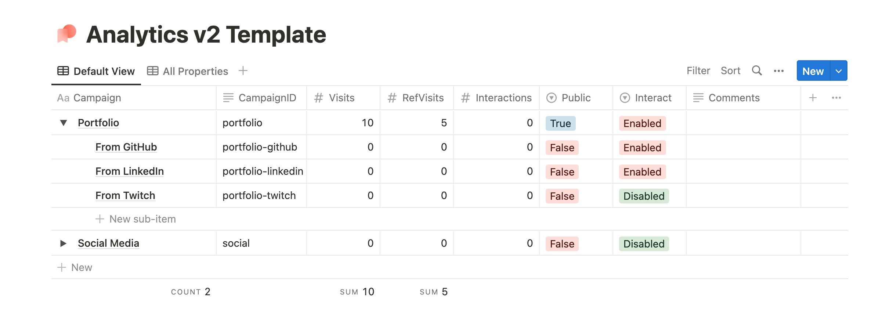
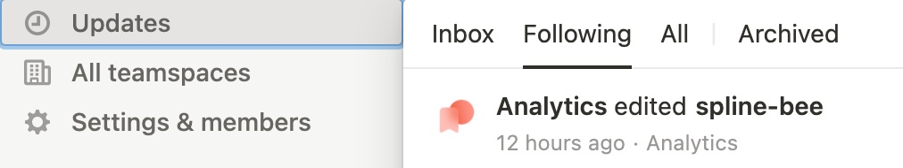

# analytics
Notion-integrated analytics API with interaction tracking. Features user-definable and app-controlled management of KPIs.

> ⚠️ Are you an Analytics V1 user? See the [V2 migration guide](./MIGRATION.md) to see how you can preserve your existing data and make use of the new Interactions API and App-Controlled Campaigns. The V1 api will continue to function as-is.

## Using the Notion Template

To get started, duplicate this Notion page template: [ivy.direct/template/analytics/v2](https://ivy.direct/template/analytics/v2)

> ⚠️ The Analytics V2 template is compatible with Analytics V1 and is the recommended default. However, if you only want V1 features, you can use the old template: [ivy.direct/template/analytics/v1](https://ivy.direct/template/analytics/v1)

Do not edit or delete any of the property names as the API requires these to function. You can add additional properties for organizational purposes, or create views that hide the properties you don't need instead.

### API V2 Property Defintions
| Property | Description |
| --- | --- |
| `Campaign` | A friendly name for the campaign. Can be anything. |
| `CampaignID` | A user-defined ID for a campaign that is URL-safe. Use this in the API. |
| `Visits` | The total number of visits to the campaign (including sub-campaigns). |
| `RefVisits` | The number of visits to the campaign from all sub-campaigns. |
| `Interactions` | The total number of interactions with the campaign (including sub-campaigns). |
| `Public` | Whether or not campaign data is returned to the client after making a POST request. Recommended to be False. |
| `Interact` | Enables or disables the API endpoint for the `Interactions` property to be changed. A value of `Dynamic` indicates that API requests are allowed to create subcampaigns to track interactions. |
| `Comments` | User-defined comments for organization. Is not public and is not used by the API. |
| `ParentCampaign` (hidden by default) | The parent campaign, as a Notion relation, of this campaign. Presence indicates that this is a sub-campaign. Automatically generated when expanding dropdown and clicking "New" under a campaign. |
| `SubCampaigns` (hidden by default) | Any associated sub-campaigns. Not used by the API directly. |
| `CreatedBy` (hidden by default) | Shows who created this campaign (you, another user, or the Analytics API) |

## Hosting the API

### With Deno Deploy
1. [Create a new Notion integration](https://www.notion.so/my-integrations) with all permissions, copy the API token, and invite it to your duplicated Notion page. If you don't want to use the App-Controlled Campaigns feature, you can safely leave out the Insert Content permission.
2. Fork this repository's `/deployable` branch and create a new automatic [Deno Deploy](https://deno.com/deploy) instance from it, adding the `NOTION_TOKEN` (from your integration) and `NOTION_DB_ID` (from your duplicated Notion page's ID: see [Notion's guide on how to find this](https://developers.notion.com/docs/create-a-notion-integration#step-3-save-the-database-id)) as environment variables
3. Make a `POST` request to `https://YOUR-SUBDOMAIN-HERE.deno.dev/v2/campaign/portfolio-github` to see it work.

### As Docker Container
1. [Create a new Notion integration](https://www.notion.so/my-integrations) with all permissions, copy the API token, and invite it to your duplicated Notion page. If you don't want to use the App-Controlled Campaigns feature, you can safely leave out the Insert Content permission.
2. Clone this repo and create a `.env` file with the ID and token, according to `.env.example`
3. Run `docker build -t analytics .` and `docker run -p 8000:8000 -d analytics`
4. Make a `POST` request to `http://localhost:8000/v2/campaign/portfolio-github` to see it work.
5. If you don't want to build the container with your secrets, you can also use Docker environment flags to pass these values in at runtime.

## API Usage
| Endpoint | Description | Returns |
| --- | --- | --- |
| `GET /v2/campaign/:CampaignID` | Gets campaign info as JSON response. | `200` or `400` if campaign not found or Public = false |
| `POST /v2/campaign/:CampaignID` | Registers +1 Visit. If the campaign is a sub-campaign, the parent will also be updated with +1 RefVisit and +1 Visit. | `204` or `400` if campaign not found |
| `POST /v2/campaign/:CampaignID /interact` | Registers +1 Interaction. If the campaign is a sub-campaign, the parent will also be updated with +1 Interaction. | `204` or `400` if campaign not found or Interact = Disabled |
| `POST /v2/campaign/:CampaignID /interact/:InteractionID` | Creates a sub-campaign for :CampaignID with default values. If exists already, registers +1 interaction. | `204` or `400` if campaign not found |
| `POST /v2/campaign/:CampaignID /visit/:InteractionID` | Creates a sub-campaign for :CampaignID with default values. If exists already, registers +1 visit. | `204` or `400` if campaign not found |

After Analytics makes an edit, you can see a summary of all unread changes as a Notion update (if you follow the page, which is true by default):

## Suggested Usage
I use top-level campaigns to track a project as a whole (total visits, referrals to it, and interactions on that project) in combination with my [redirect](https://github.com/ivynya/redirect) service.

I create sub-campaigns for individual promotional links, referrers, or other sources of traffic to track the number of visits and interactions from that source. I also call these campaigns from certain areas of my sites to track which specific pages people visit.

Finally, for items that require dynamic tracking, I use the `Interact` property to enable the API to create and use interactions on sub-campaigns. This is useful to log important micro-interactions on pages that would otherwise be a lot of clutter if they were top-level campaigns, and create campaigns automatically that I otherwise cannot do by hand.

These analytics hits are typically done server-side to prevent being blocked by scripts or slowing down page loads. Because no "creepy" or personally-identifiable data (that I wouldn't be able to use anyway) like location, IP, device specifications, mouse cursor movement, etc etc is collected - only page hit numbers and interactions are - this is a great way to track user behavior without being invasive.

## Compatibility with [ivynya/redirect](https://github.com/ivynya/redirect)
Analytics V2 remains compatible with `redirect` to track visits for dynamic redirects, managed from Notion. See the `redirect` GitHub page for setup and usage.

## Licensing & Contributing
Contributions are welcome! Please first open an issue on this repository.

This repository lives under MIT license.