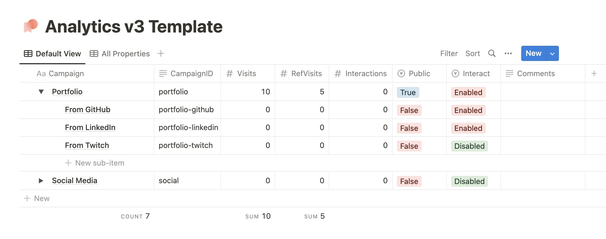

# analytics


Notion-integrated analytics solution with interaction tracking. Features user-definable and app-controlled management of different campaigns and KPIs by API and visually through a Notion database.

> ⚠️ Are you an Analytics V1 or V2 user? See the [migration guide](./MIGRATION.md) to see how you can preserve your existing data and make use of new features and performance improvements in V3. No rush, though! V1 and V2 API endpoints are still supported and functional for now.

## Using the Notion Template

To get started, duplicate this Notion page template: [ivy.direct/template/analytics/v3](https://ivy.direct/template/analytics/v3)

[](https://ivy.direct/template/analytics/v3)

Do not edit or delete any of the property names as the API requires these to function. You can add additional properties for organizational purposes, or create views that hide the properties you don't need instead.

### V3 Notion Property Defintions
| Property | Description |
| --- | --- |
| `Campaign` | A friendly name for the campaign. Can be anything. |
| `CampaignID` | A user-defined ID for a campaign that is URL-safe. Use this in the API. |
| `Visits` | The total number of visits to the campaign (including sub-campaigns). |
| `RefVisits` | The number of visits to the campaign from all sub-campaigns. |
| `Interactions` | The total number of interactions with the campaign (including sub-campaigns). |
| `Public` | Whether or not campaign data is returned to the client after making a POST request. Recommended to be False. |
| `Interact` | Enables or disables the API endpoint for the `Interactions` property to be changed. A value of `Dynamic` indicates that API requests are allowed to create subcampaigns to track interactions. |
| `Comments` | User-defined comments for organization. Is not public and is not used by the API. |
| `ParentCampaign` (hidden by default) | The parent campaign, as a Notion relation, of this campaign. Presence indicates that this is a sub-campaign. Automatically generated when expanding dropdown and clicking "New" under a campaign. |
| `SubCampaigns` (hidden by default) | Any associated sub-campaigns. Not used by the API directly. |
| `CreatedBy` (hidden by default) | Shows who created this campaign (you, another user, or the Analytics API) |

## Hosting the Analytics API
1. [Create a new Notion integration](https://www.notion.so/my-integrations) with all permissions, copy the API token, and invite it to your duplicated Notion page.
2. Pull the Docker image artifact from GitHub Container Registry
3. Clone this repo and create a `.env` file with the ID and token, according to `.env.example`
4. Run the Docker container and pass in the environment variables: `docker run -p 3000:3000 --env-file .env ivynya/analytics`
5. Make a `POST` request to `http://localhost:3000/v3/campaign/portfolio-github` to see it work.

## V3 API - Endpoints
The following API endpoints are described in the table below. Each endpoint may return one of the listed HTTP status codes in the `Returns` column, as well as the additional possibility of a `200 OK` (described by the Standard Response Protocol further below) or a `500` error if things go catastrophically wrong.

| Endpoint | Description | Returns |
| --- | --- | --- |
| `GET /v3/campaign/:CampaignID` | Gets campaign info as JSON response. | `200`, `204`, `400` SRP(Campaign) |
| `POST /v3/campaign/:CampaignID` | Registers +1 Visit. If the campaign is a sub-campaign, the parent will also be updated with +1 RefVisit and +1 Visit. | `200`, `204`, `400` SRP(Campaign) |
| `POST /v3/campaign/:CampaignID /interaction` | Registers +1 Interaction. If the campaign is a sub-campaign, the parent will also be updated with +1 Interaction. | `200`, `204`, `400` SRP(Campaign) |
| `GET /v3/campaign/:CampaignID /interaction/:InteractionID` | Gets interaction info as JSON response. | `200`, `204`, `400` SRP(Subcampaign) |
| `POST /v3/campaign/:CampaignID /interact/:InteractionID` | Creates a sub-campaign for :CampaignID with default values. If exists already, registers +1 interaction. | `200`, `204`, `400` SRP(Subcampaign) |
| `POST /v3/campaign/:CampaignID /visit/:InteractionID` | Creates a sub-campaign for :CampaignID with default values. If exists already, registers +1 visit. | `200`, `204`, `400` SRP(Subcampaign) |

After Analytics makes an edit, you can see a summary of all unread changes in the Notion history for the page.

## V3 API - Standard Response Protocol (SRP)

The standard response protocol is a flow that describes potential responses from the API if the given Campaign or Interaction is set to `Public` = `True`or not in the Notion database.

For **SRP(Campaign)** endpoints described above, if `Public` is `True` and the API request is successful, the endpoint will return a `200 OK` response with the following JSON schema describing the `Campaign` that corresponds to the `:CampaignID` called:

```ts
{
  "ID": string // Notion ID of the campaign
  "CampaignID": string, // User-defined ID of the campaign
  "Visits": number, // Total visits to the campaign
  "RefVisits": number, // Total visits to the campaign from sub-campaigns
  "Interactions": number, // Total interactions with the campaign
  "Public": string, // "True" or "False"
  "Interact": "Dynamic", // "Dynamic" "Enabled" or "Disabled" - Dynamic allows API requests to create sub-campaigns to track interactions, Enabled allows API requests to track interactions, Disabled does not allow API requests to track interactions at all
}
``` 

If the campaign is not public (`Public` = `False`), and the API request was otherwise successful, the API will return a `204 No Content` response.

For **SRP(Interaction)** endpoints described in the table above, the exact same response flow and JSON schema are used - except, instead of describing `:CampaignID`, it describes the campaign object represented by `:CampaignID-:InteractionID` (`:InteractionID` subcampaign of `:CampaignID`) instead.

## API Support Matrix

The following table shows which Analytics release supports which API versions. Use this table to inform your decision on whether or not you can upgrade to a newer version of Analytics while still using old API versions.

**❌ = Not Supported | ✅ = Supported | ⚠️ = Deprecated, Functional**

| API Version | Analytics V1 | Analytics V2 | Analytics V3 |
| --- | --- | --- | --- |
| V1 | ✅ | ✅ | ⚠️ |
| V2 | ❌ | ✅ | ⚠️ |
| V3 | ❌ | ❌ | ✅ |

## Suggested Usage
I use top-level campaigns to track a project as a whole (total visits, referrals to it, and interactions on that project) in combination with my [redirect](https://github.com/ivynya/redirect) service.

I create sub-campaigns for individual promotional links, referrers, or other sources of traffic to track the number of visits and interactions from that source. I also call these campaigns from certain areas of my sites to track which specific pages people visit.

Finally, for items that require dynamic tracking, I use the `Interact` property to enable the API to create and use interactions on sub-campaigns. This is useful to log important micro-interactions on pages that would otherwise be a lot of clutter if they were top-level campaigns, and create campaigns automatically that I otherwise cannot do by hand.

These analytics hits are typically done server-side to prevent being blocked by scripts or slowing down page loads. Because no "creepy" or personally-identifiable data (that I wouldn't be able to use anyway) like location, IP, device specifications, mouse cursor movement, etc etc is collected - only page hit numbers and interactions are - this is a great way to track user behavior without being invasive.

## Compatibility with [ivynya/redirect](https://github.com/ivynya/redirect)
Analytics V3 remains compatible with `redirect` to track visits for dynamic redirects, managed from Notion. See the `redirect` GitHub page for setup and usage.

## Licensing & Contributing
Contributions are welcome! Please first open an issue on this repository before making a pull request.

To run the project locally, you need Go installed (tested on 1.20+). Create a .env file according to the .env.example and then source it into your environment. Then, run `go run ./cmd/analytics` to start the server on localhost:3000.

This repository lives under MIT license.